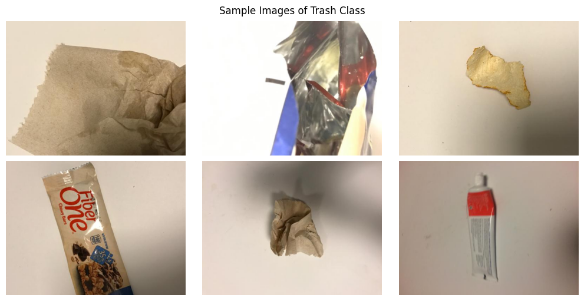
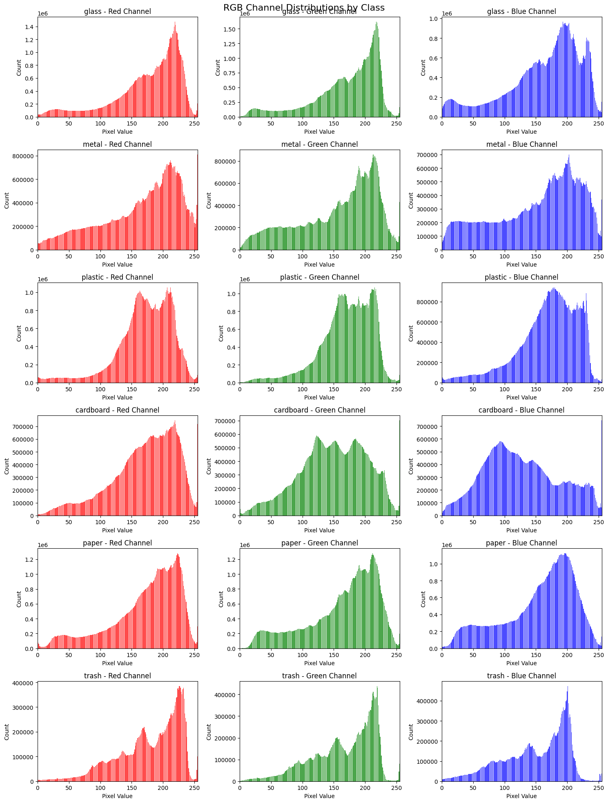

# Trashnet Image Classification

## Introduction
Hello! For starters, let me introduce myself. My name is Vincent currently an undergraduate student in the Faculty of Computer Science Universitas Indonesia and majoring in Information Systems. This repository serves as take home test documentation for the AI Engineer role in Ada Mata. This project implements a computer vision solution for classifying waste materials into different categories: cardboard, paper, plastic, metal, and glass. The system I developed uses state-of-the-art deep learning models to achieve high accuracy in waste classification, contributing to more efficient recycling processes and environmental sustainability efforts.

## Exploratory Image Analysis - Key Takeaways
The initial phase of this project involved comprehensive exploratory image analysis across all waste categories. During this investigation, we uncovered several significant challenges that informed our subsequent approach. A primary concern emerged regarding the 'trash' class, which demonstrated considerable ambiguity in its definition and intersections with other categories. I observed numerous instances where items were incorrectly categorized within this class, such as can be seen in the image below where there are obvious items categorized in plastic but categorized in trash. This can potentially introducing significant noise into our training process.



My analysis of image characteristics also reveals that the RGB pixel distributions were consistently skewed towards the right across all classes. This finding highlighted a crucial consideration for our preprocessing pipeline, as such skewness could potentially impact model learning and generalization capabilities.



## Methodology
My approach to waste classification follows a carefully considered systematic methodology. Based on the initial analysis, I made the strategic decision to **remove the problematic 'trash' class entirely**, choosing to focus on clearly defined waste categories. This decision was driven by the need to maintain clear classification boundaries and reduce potential confusion in the model training process.

To address the identified pixel distribution skewness, I decided to incorporate histogram equalization as a key preprocessing step. This technique helped normalize the pixel distributions across the dataset, creating more favorable conditions for model learning. This methodology emphasizes the importance of clean, well-structured data as a foundation for reliable model performance.

## Data Preprocessing
The preprocessing pipeline I developed incorporates multiple data augmentation techniques to enhance model robustness. My augmentation strategy includes horizontal flipping, random 90-degree rotations, brightness and contrast adjustments, Gaussian noise injection, and various geometric transformations including random scaling and shift-scale-rotate operations. These transformations work together to create a more diverse and representative training dataset.

The implementation of histogram equalization proved particularly effective in normalizing pixel distributions across the images. This preprocessing step, combined with my comprehensive augmentation pipeline, significantly improved the quality of the training data. The removal of the ambiguous 'trash' class further refined the dataset, creating clearer decision boundaries for the classification task.

## Model Architecture
My model selection process evaluated three state-of-the-art architectures: YOLOv5, YOLOv8, and WasteNet. I chose each model for its unique strengths and potential advantages in waste classification. I selected the YOLO family of models for their exceptional balance of speed and accuracy, while I included WasteNet based on its documented success in waste classification tasks from recent [literature](https://arxiv.org/abs/2006.05873).

All models were initially pre-trained on ImageNet to leverage transfer learning benefits. I then fine-tuned each model for 50 epochs, working within a three-day project timeline constraint. After careful evaluation, YOLOv8 emerged as my preferred model, achieving an impressive 96% accuracy even within the limited training window. This performance significantly outpaced the other candidates and demonstrated excellent generalization capabilities.

## Model Evaluation & Analysis
My model evaluation process revealed compelling results across multiple performance metrics. The YOLOv8 model demonstrated exceptional performance, achieving 96% accuracy after just 50 epochs of training. This section presents a detailed analysis of the all the models involved in this project:

<div align="center">

| Model       | Top 1 Accuracy             | Training Loss       | Validation Loss    |
|-------------|----------------------------|---------------------|--------------------|
| **YOLOv8**  | **96.0%**                  | **0.02515**         | 0.95137            |
| YOLOv5      | 77.9%                      | 0.93293             | **0.83259**        |
| WasteNet    | 61.2%                      | 1.02995             | 1.03985            |

</div>

In comparison, YOLOv5 achieved a respectable but notably lower accuracy of 77.9%. Its training loss of 0.93293 and validation loss of 0.83259 suggest relatively stable learning, though not reaching the same level of performance as YOLOv8.

WasteNet on the other hand, despite its specialization in waste classification, showed the lowest performance with 61.2% accuracy. Its higher training loss of 1.02995 and validation loss of 1.03985 indicate potential difficulties in learning the underlying patterns in the data effectively. This underperformance might be attributed to the limited training time of 50 epochs, where in the paper discussing WasteNet, this model was trained for 100 epochs.

## Future Improvements
Looking forward, I've identified several solutions for enhancing the system's capabilities. A significant opportunity lies in the reannotation of items from the originally excluded 'trash' class into their appropriate categories, which would effectively expand the training dataset while maintaining classification clarity. This process would not only increase data volume but also potentially capture edge cases that could improve model robustness.

The technical implementation could benefit from hardware optimizations, particularly through the utilization of multiple GPUs for parallel training. This would enable me to extend training periods beyond the current 50-epoch limitation and potentially explore more sophisticated model architectures or ensemble methods.


# Reproducing the Model
```
# Create virtual environment
python -m venv env

# Install project requirements
pip install -r requirements.txt

# Reproduce dataset with preprocessing and augmentation
python dataset_collection.py

# Fine-tune YOLOv8 model on dataset
python train.py
```

The training process can be customized through two main approaches:
1. Configuration File (train.cfg)
- Contains hyperparameters and model settings
- Modify training parameters such as learning rate, batch size, and optimization settings
2. Model Selection:
- The train.py script can be modified to switch between different model architectures

For a detailed look at the model development process, you may refer to the three notebooks in the `notebooks` directory, including `wastenet_trashclf.ipynb`, `yolov5_trashclf.ipynb`, and `yolov8_trashclf.ipynb`. Another notebook in this directory is the `exploratory_image_analysis.ipynb` notebook which shows a comprehensive explanation on image analysis in the dataset.